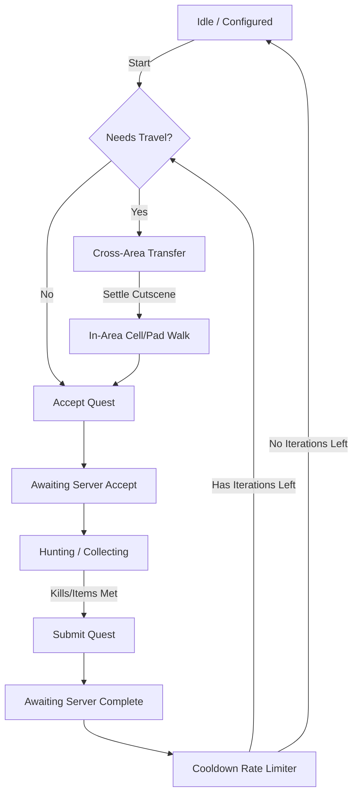

# Beyond - Feature Documentation

Welcome to the official feature documentation for the **Beyond** MelonLoader utility / mod menu / bot. This guide provides a detailed breakdown of every module, config panel, and advanced automation feature designed for the game client.

---

## 🧭 Navigation & Core Interface

The mod menu utilizes a custom GUI system that is lightweight, draggable, and fully integrated with the game window.

*   **Floating Toggle Button:** An overlay button containing an exclamation mark indicator. Clicking this toggles the visibility of the main hub.
*   **Draggable Windows:** All modules open in standalone sub-windows that can be dragged anywhere on the screen.
*   **Mouse-Over UI Interception:** Built-in click-through protection prevents the player from accidentally moving or interacting with the game world when clicking menu options.

---

## 🛠️ FakeDev Settings

The **FakeDev** module simulates developer and administrator privileges on the local client. This allows players to bypass frontend restrictions and test restricted client interfaces.

| Feature | Description | Technical Implementation |
| :--- | :--- | :--- |
| **Membership Toggle** | Toggles VIP/Member status locally. Updates the player's name color to VIP green/gold. | Overrides the local `Player.UpgradeDays` field and triggers a name color refresh. |
| **Access Level Tiers** | Instantly set your developer tier to level **30**, **40**, **50**, **60**, or **100**. | Modifies `Entity.mainPlayer.AccessLevel` to bypass local `hasAccess` security checks. |
| **Open Dev UI** | Launches the game's built-in developer debug console. | Instantiates and runs the internal `DevWindow` routine. |
| **Reset to Default** | Restores the original account privileges captured at mod startup. | Reverts modified values back to stashed startup values. |

> [!NOTE]
> Privileges set in the FakeDev settings are local-only and client-side. They allow access to user interface features and local checks, but do not override authoritative server-side checks.

---

## 📦 Loaders

The **Loaders** panel enables the loading of game content directly via IDs, bypassing the normal NPC dialogs or zone requirements.

*   **Shop Loader:**
    *   *Load Shop:* Enter any valid Shop ID to open the shop interface instantly from anywhere.
    *   *Load Merge Shop:* Forces the target Shop ID to load in merge shop mode, displaying crafting recipes.
*   **Quest Loader:**
    *   *Load Quest:* Input a Quest ID to force the quest window to appear on your screen, allowing you to accept it.
    *   *Abandon Quest:* Abandon a quest directly by ID.

---

## ⚔️ Autoskills & Config

The core **Autoskills** module automates your skill-casting rotations for combat, minimizing down-time.

*   **Autoskills Toggle:** Quick-switch to activate/deactivate auto-casting.
*   **Autoskills Configuration Window:**
    *   *Per-Skill Delays:* Assign custom cast delays in milliseconds for each of the 5 skill slots (Key 1 to Key 5).
    *   *Rotational Priority:* Use the Up (▲) and Down (▼) buttons to rearrange the execution sequence of skills.
    *   *Selective Autoskills:* Toggle checkboxes next to each skill slot to enable or disable it from the auto-rotation.

---

## 🛰️ Network Packet Tools

A complete packet suite for network debugging, sniffer operations, and request injection.

### 1. Packet Interceptor
*   **Status Indicators:** Passive (Green) or Intercepting (Red).
*   **Block Packets:** Halts outbound client-to-server (`c2s`) packets.
*   **Allow Packets:** Resumes normal packet flow.
*   **Log Allowed Toggle:** Log packets while intercepting or running passively.
*   **Scrollable Terminal:** Review intercepted network payloads in real-time.

### 2. Packet Sniffer
*   **Target Selection:** Listen to Client-to-Server (`c2s`), Server-to-Client (`s2c`), or both simultaneously.
*   **Live Feed:** Displays a chronological log of packets, labeled by command name.
*   **JSON Preview Panel:** Click any packet in the log to inspect its raw JSON payload in a scrollable, word-wrapped text area.
*   **Clipboard Integration:** One-click copy buttons copy individual log rows or the selected preview JSON directly to your system clipboard.

### 3. Packet Sender (Client-to-Server Injections)
*   **Manual Injection:** Draft and transmit custom payloads directly to the server.
*   **Command Placeholder Support:** Automatically replaces `<charname>` or `<username>` strings in the parameters with the player's active character name before sending.
*   **Single String Mode:** Disables comma splitting on arguments, which prevents mangling text fields that contain literal commas (e.g. chat messages).

### 4. Packet Receiver (Server-to-Client Injections)
*   **Fake Server Packet Injector:** Push synthetic server-to-client JSON payloads directly into the client's packet processing queue. Useful for triggering local UI updates, alerts, or spoofing server events.
*   **Preloaded Presets:**
    *   `Preset: rNotify` - Instantly triggers a system notice notification alert box.
    *   `Preset: Server Chat` - Inject a chat message from `[SERVER]` on the system channel.
    *   `Preset: Zone Chat` - Spoof a zone channel chat message from any character name.

> [!TIP]
> **Persistent Packet Logger:**
> The mod automatically logs every single network packet in real-time to a file at `MelonLoader/UserData/Beyond/packets.jsonl`.
> It formats matches identically to the standard proxy `packets.jsonl` format, complete with Unix timestamps (`ts`), direction indicators (`dir`), and synthetic flags (`src: "mod"`) for analysis scripts.
> It includes an automatic 50ms byte-level deduplication handler to prevent log bloat.

---

## 🤖 Quest Runner (Automation Engine)

The **Quest Runner** is a live state machine that automates completing quests on a loop. It handles the lifecycle of accepting, traveling, hunting, and turning in quests automatically.

### Automation Features:
*   **Automatic Navigation:** 
    *   *Cross-Area Transfers:* Uses the game's `tfer` commands to hop between zones automatically. It includes a custom post-teleport settle delay (~14 seconds) to let cutscenes complete, preventing dropped requests.
    *   *Goto Pad Navigation:* Rather than instantly teleporting across coordinates, the runner detects and physically walks your character onto the in-world transition pads. This ensures your visual position matches the server cell location.
*   **Live Quest Picker:** An inline overlay database of all known quests. You can filter quests by ID, Name, or Storyline keywords.
*   **Live Objective Tracking:** Renders up to 6 objectives in real-time, complete with checkboxes, objective types (e.g. Killcount, Collect), target counts, current progress, and references.
*   **Timeout & Safeguards:** Built-in timers protect against desyncs (90s hunt progress timeout, 25s map transfer timeout, 8s complete timeout). If a problem occurs, it halts and logs the reason.
*   **Rate-Limiting Cooldowns:** Employs an adjustable cooldown between turn-ins to prevent triggering server spam bans.
*   **Quest Chain Execution:** Cycles through custom multi-quest schedules defined in `chains.json`.

---

## 🎭 Spoofers & Cosmetic Overrides

Spoofers manipulate local memory variables to override visual elements on the local client without modifying the database on the game server.

*   **Name Spoof:** Instantly change your local nameplate, HUD name, chat bubbles, and chat window name to any string (up to 24 characters). It maintains normal nameplate updates and avoids system garbage collection sweeps.
*   **Gender Flip:** Flips the client's gender model (Male ↔ Female) and regenerates the character avatar rig instantly. Pronouns and server checks remain untouched.
*   **Visual Gear Spoofing:** Override specific equipment slots on your character avatar with any asset bundle:
    *   *Supported Slots:* **Helm**, **Armor**, **Cape (Back)**, **Weapon**, and **Pet**.
    *   *Weapon Spoofing:* Requires a cataloged item to properly synchronize prefab names and item types.
    *   *Become Monster:* Transforms the player's avatar rig to match any in-world monster. (Automatically reverts when entering combat states per game design).
    *   *Monster-to-Pet:* Overrides your equipped pet's asset model, offsets, and scale with any monster model.
*   **Shared Asset Catalog Browsers:**
    *   Interactive catalogs for Helms, Armors, Capes, Weapons, Pets, and Monsters.
    *   Passively harvests assets (bundles, scales, offsets, item types) as you encounter them in-world, updating your local catalogs automatically.
    *   Filter search bar to find assets by filename or parsed item name.
    *   Safety-confirmable catalog clean button ("Clear" → "Confirm?").
*   **Jukebox (Soundtrack Player):**
    *   Catalog of passively-logged game music tracks.
    *   Search and play soundtracks on-demand by ID or name (displaying track length).
    *   Actions to **Play**, **Stop**, or **Restore Area BGM** (returns to the default BGM of your current map).
*   **Pet Combat Animations:** Cycles and loops custom combat animations for your spoofed monster pet.

---

## 🧬 Retro Tests (Advanced Combat Scheduler)

The **Retro Tests** panel is an advanced macro engine and combo scheduler that executes custom skill sequences.

*   **Custom Combo Input:** Specify exact key press loops as comma-separated values (e.g., `2,3,4,2,3,2,1`).
*   **Presets Database:**
    *   Name and save your custom rotations to a local database.
    *   Quick-select list to load, apply, or delete presets.
*   **Clipboard Import / Export:** Share configurations using a single text string serialized in the format: `Name|Combo|Delays|Waits|Frees`.
*   **Win32 File Dialog Integration:** Imports Windows' native `comdlg32` system file dialogs for **Save File** and **Load File** actions. Profiles are stored under `UserData/Beyond/`.
*   **Detailed Skill Tuning:**
    *   *Delay (ms):* Set custom cast timings per slot.
    *   *Wait Toggle:* If checked, the sequencer pauses and waits for the skill's cooldown to finish before casting the next step in the combo.
    *   *Free Toggle:* Marks the skill as a utility or resource-free instant cast, preventing delays or wait checks. If the skill is off-cooldown, the skill will be used.
